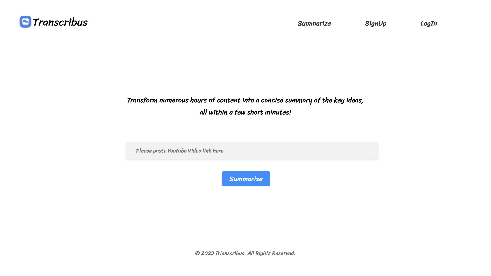

# YouTube Video Summarizer App

This is a Flask-based web application that serves as a YouTube video summarizer. It uses various libraries and APIs to fetch video transcripts, perform text summarization, and generate concise summaries using ChatGPT and highlights of YouTube video content.

## Application Access

<p align="center">
  
</p>
<!--  -->

Url of Page: [Transcribus](https://transcibus.vercel.app/)

## Setup

1. Clone the repository to your local machine.
2. Install the required Python packages by running:
   ```bash
   pip install -r requirements.txt
   ```

Rename config.ini.example to config.ini and provide your OpenAI API key.

## Usage
- Run the Flask application using the following command:

  ```bash
  python app.py
  ```
  
  The app will start and be accessible at http://localhost:8080.

- Access the web interface through your browser and follow the instructions to summarize a YouTube video.

## Features
Fetches video transcripts using the YouTube API.
- Utilizes OpenAI API for text summarization.
- Provides both a full summary and highlights of the video content.
- Displays the transcript and generated summaries on the web interface.

## Architecture
The app follows the following workflow:
- User provides a YouTube video URL.
- The app fetches the video transcript using the YouTube API.
- The transcript is split into chunks for processing.
- OpenAI API (ChatGPT) is used to generate summaries and highlights using predefined templates.
- The summarized content is displayed to the user.

## Contributing
Contributions to this project are welcome! Feel free to open issues or pull requests for bug fixes, enhancements, or new features.

License
This project is licensed under the MIT License.
